# MINESWEEPER 💣

## INTRODUCTION :

This is a project in which i have recreated the all time classic MINESWEEPER with some additional feautures of my own . This game has three levels you can play in 
which are beginner,intermediate and advanced , I have also provided a global top 10 leader board ranked according to the time they took to finish. Let me tell you 
one thing the code is not optimised to the best to reduce the time complexity and more but it works fine and is really enjoyable i have released these as an 
executable package to all my close friends and they enjoyed it . This game is build using PYTHON, i have used PYGAME module for the game mechanics , the global 
top 10 list was built using SUPABASE(i enjoy it very much for my small projects check it out if you have time). Finally feel free to use my code modify it however you
like and enjoy the game.😁

## FEAUTURES

- This game can be played offline too but note that if offline the time data will not be        pushed to the global rank list 

- Has a retro vibe

- The game has a login/sign up option:
  
  - sign up:
    
    Sign up  is only required by the user to do once , The users data is stored in a local json file. let me show you a preview
    of the sign up page
    
    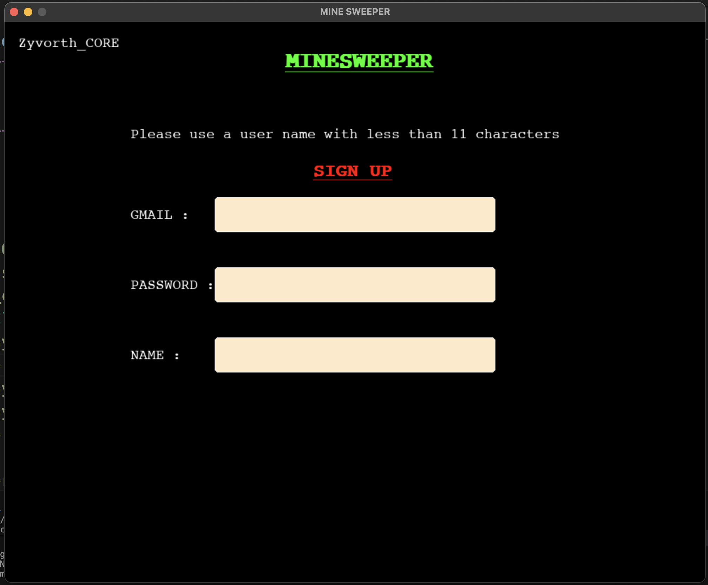
    
  - login :

    login is required by the user to do if and only if the user didint play the game continuosly for 30 days.gmail and password will be rquired
    to login
    preview:
    
    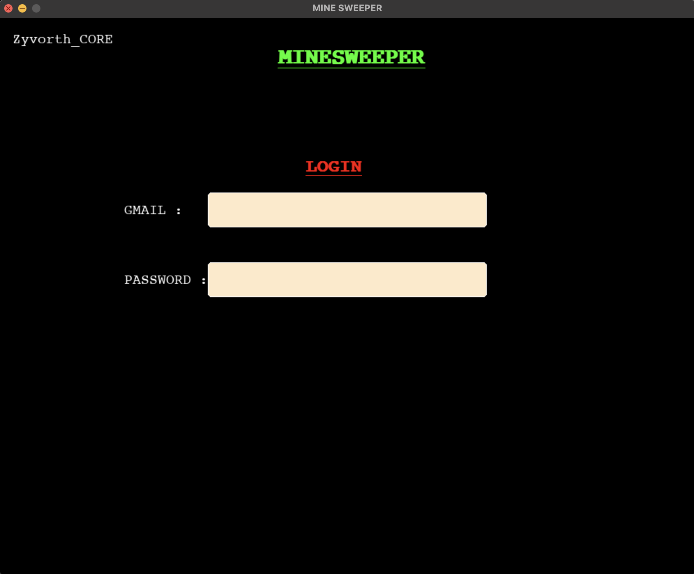

    
- has music for most of the scenarios(background music,win,lose,clicking button)
  
- the game  has easily understandble GUI
  preview:
  
    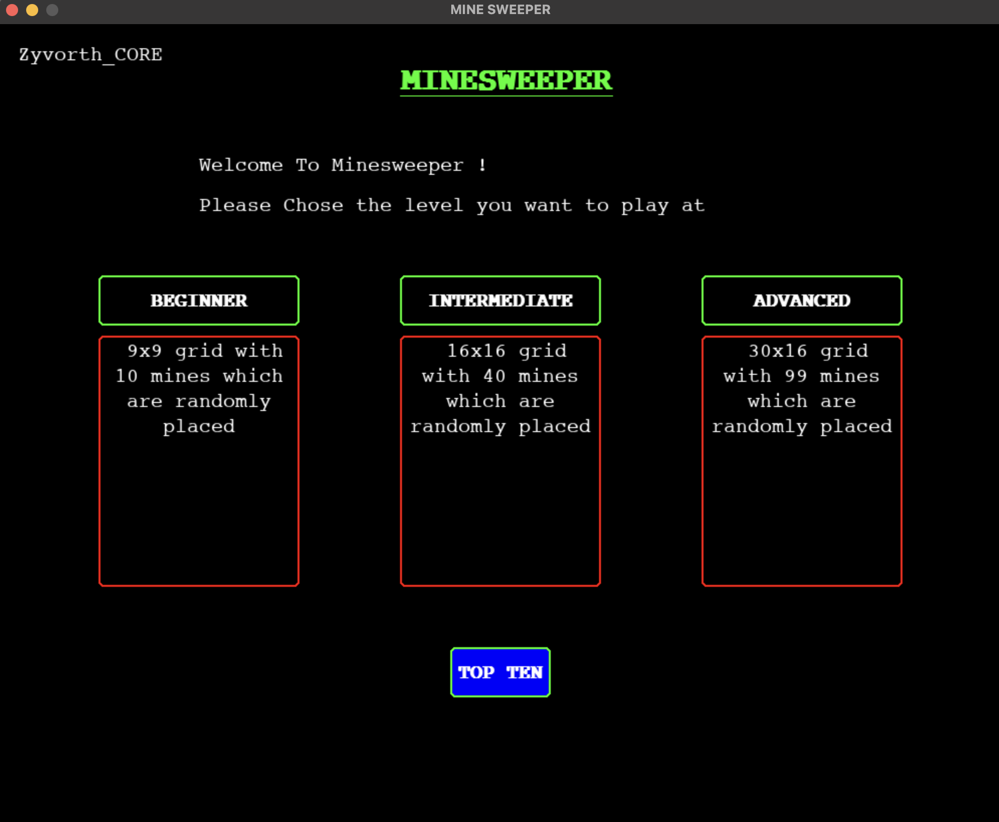

-Has three modes :

  - Beginner : the easiest level with a 9x9 grid and 10 bombs randomly placed

    
     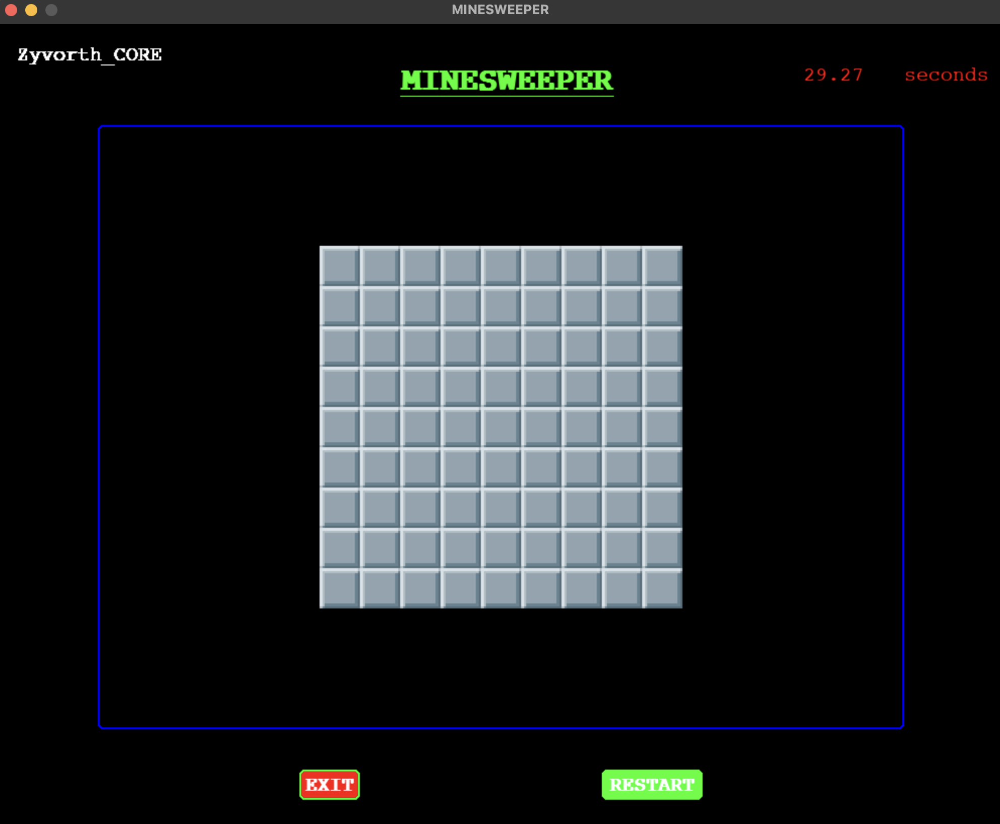

  - Intermediate : the medium level with a 16x16 grid and 40 bombs randomly placed

    
     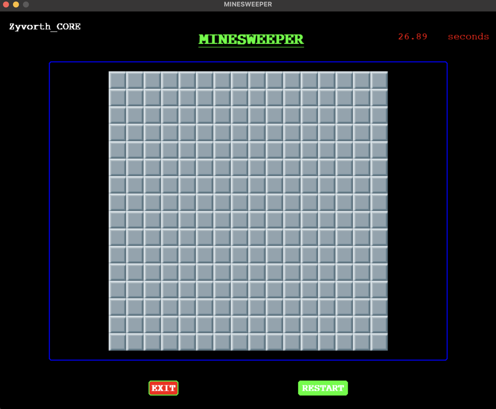
    

  - Advanced: the hardest level with a 30x16 grid and 99 bombs randomly placed

    
     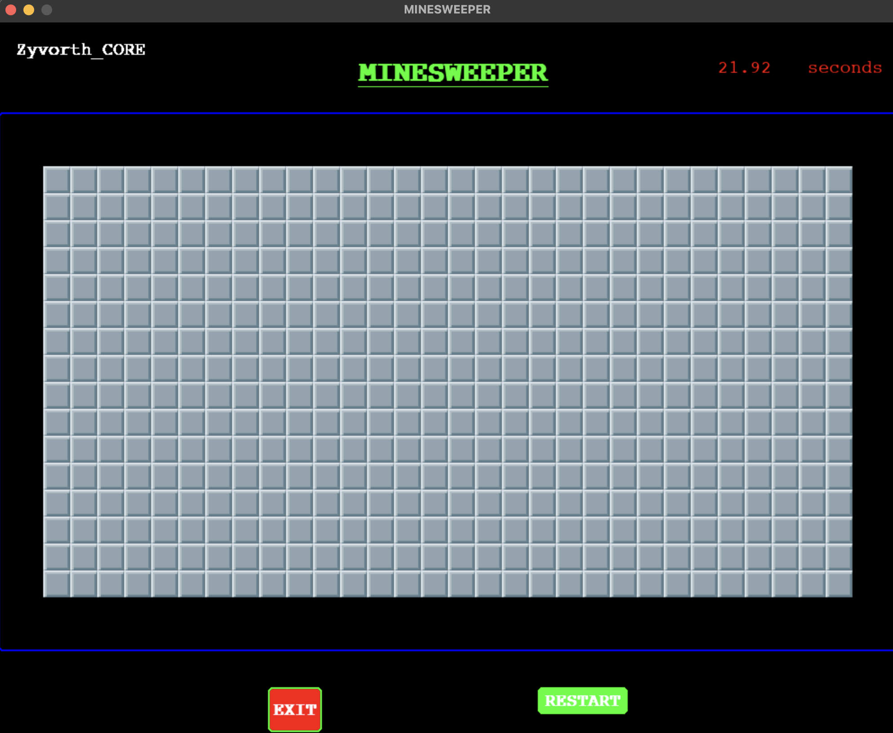

    
- it also has a fairly reactive hover effect on the tiles:

  
    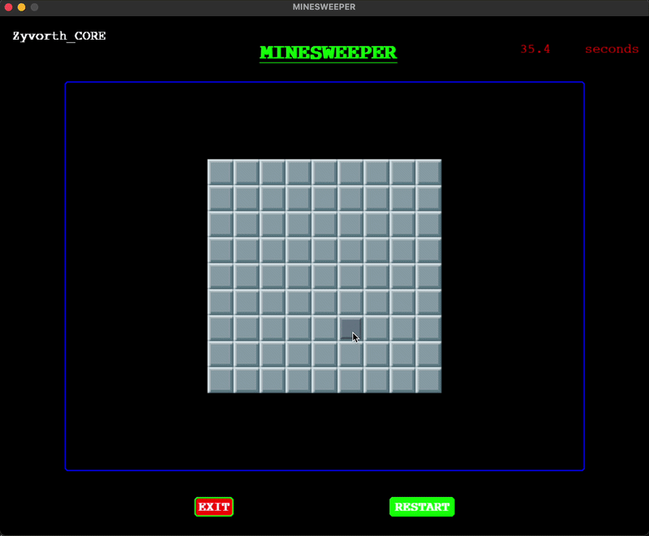

- This is how it will look if you:(there are win and lose sound effects too)

  - win:

    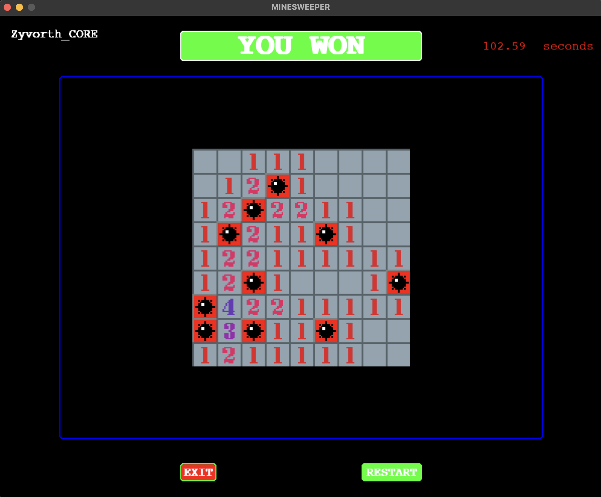

  - lost:

    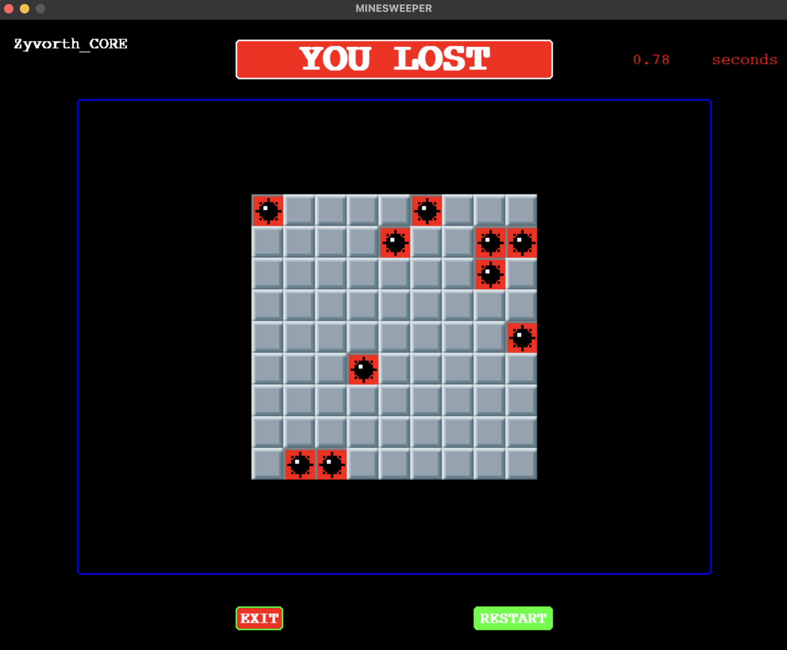
  

    
- Has the ability to flag tile which are mine:
  to flag and deflag the key :
  - 1:"f"(hold down)
  - 2: right click > flag will be placed right after right clicking
  - 3:release "f" key
    
  🛑 if you dont hold down the key "f" while right clicking the bomb will blast

  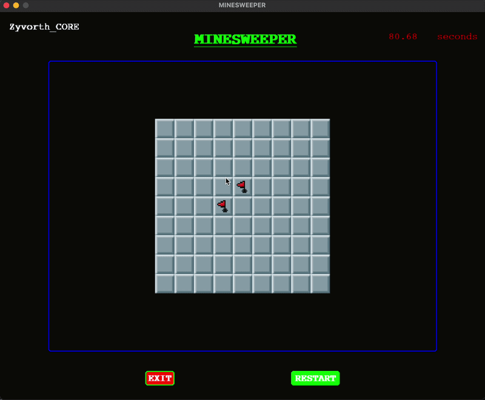

  
- The mines are randomly placed using the SECRETS module and the thing i really enjoyed about is that it works on the systems
  ENTROPY ( i feel like i have seen this word everywhere, i really love it and i know it does simply explain most of the universe🗣️)

  if you want to see its python documentation:

    

- There is a top ten list from each mode which is made using SUPABASE :
  (dont mind the names these are just fake names😂 that i had added while testing)

  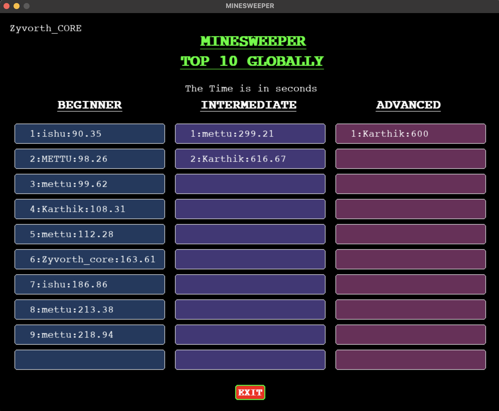

## HOW TO PLAY AND INTERACT WITH THE GAME

- All the actions pressing a button , revealing tiles all require right click only
- to flag a tile hold down the key "f" and right click on the desired tile
- deflag do the above again
- sign up/login boxes can be filled with just typing and pressing enter key no mouse actions off box selections
  will be recieved

## 🛑 HOW TO CONVERT THE GAME TO A PLAYABLE FORMAT

- This is an online game 
- create a folder called "MINESWEEPER"
- just add the files : minesweeper.py,minesweeper_back.py,MINESWEEPER_LAUNCHER.py,IMAGES,SOUNDS
- ensure you are follwing the correct path otherwise feel free to change the path however you like
- if you want you can convert this to a single executable with PYINSTALLER
- also feel free to add logos and customise even the rules if you want as you like (but please dont use my supabase url it will not work create a database of your own)

## Credits
- All the png assets was from creator Nelson "skree" i found on itch.io heres the link:

  

- SOUNDS where just random royalty free ones i found on internet
  
## Developer

Made by ZYVORTH_Karthik
  
  
    
